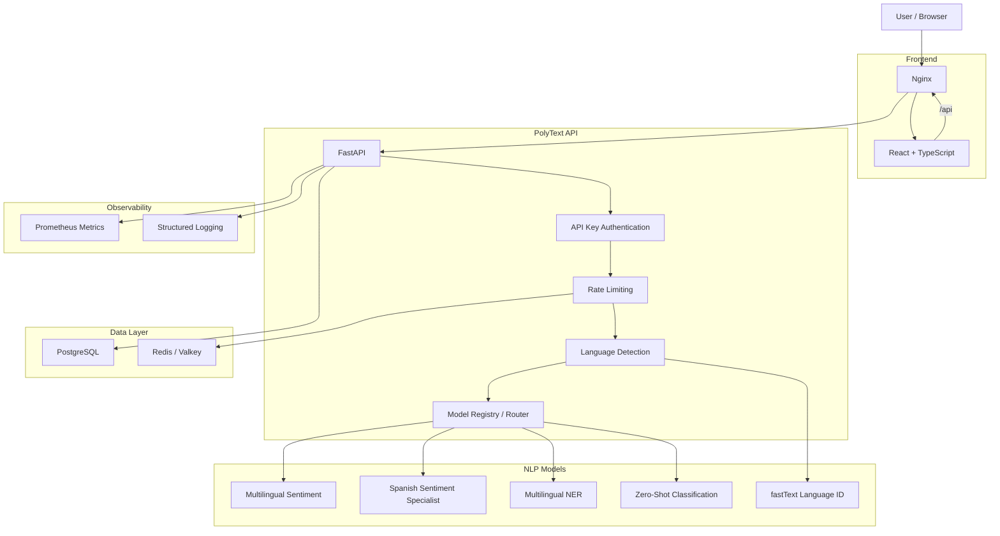

# PolyText Architecture

PolyText is a multilingual NLP platform built around a production-oriented FastAPI backend and an interactive React playground.

```mermaid
flowchart TD
    User["User / Browser"]

    subgraph Frontend["Frontend"]
        React["React + TypeScript"]
        Nginx["Nginx"]
    end

    subgraph API["PolyText API"]
        FastAPI["FastAPI"]
        Auth["API Key Authentication"]
        RateLimit["Rate Limiting"]
        Router["Model Registry / Router"]
        Lang["Language Detection"]
    end

    subgraph Models["NLP Models"]
        Cardiff["Multilingual Sentiment"]
        Robertuito["Spanish Sentiment Specialist"]
        Davlan["Multilingual NER"]
        MDeBERTa["Zero-Shot Classification"]
        FastText["fastText Language ID"]
    end

    subgraph Data["Data Layer"]
        Postgres["PostgreSQL"]
        Redis["Redis / Valkey"]
    end

    subgraph Observability["Observability"]
        Metrics["Prometheus Metrics"]
        Logs["Structured Logging"]
    end

    User --> Nginx
    Nginx --> React
    React -->|"/api"| Nginx
    Nginx --> FastAPI

    FastAPI --> Auth
    Auth --> RateLimit
    RateLimit --> Lang
    Lang --> Router

    Lang --> FastText

    Router --> Cardiff
    Router --> Robertuito
    Router --> Davlan
    Router --> MDeBERTa

    FastAPI --> Postgres
    RateLimit --> Redis

    FastAPI --> Metrics
    FastAPI --> Logs
```
